# line_system — renderer de líneas y nodos

Renderer determinístico de la familia visual `line_system` de Motion
(`design-system/visual-language/FAMILIAS_VISUALES.json`).

Produce placas 1080x1350 en SVG autocontenido (las OTF oficiales van embebidas y
subseteadas en el propio archivo) y su PNG rasterizado con Chromium, de modo que
el PNG y el SVG son idénticos.

No reescribe copy: el texto del spec se dibuja literal.

## Cómo correrlo

```bash
pip install -r design-system/line_system/requirements.txt
python -m playwright install chromium

python design-system/line_system/render_lineas.py \
    design-system/slides/2026-08-04-mar-autoridad-transversal.json \
    design-system/generated/2026-08-04-mar-autoridad-transversal
```

Flags: `--no-png` (solo SVG), `--no-contact-sheet`.

Salida:

```text
<outdir>/svg/placa-01.svg …
<outdir>/png/placa-01.png …      (1080x1350)
<outdir>/contact-sheet.png       (grilla con el título de la pieza)
```

Para la pieza estática de LinkedIn los archivos se llaman
`svg/linkedin-autoridad-transversal.svg` y `png/…​.png`.

El catálogo de primitivas se regenera con:

```bash
python design-system/line_system/catalogo.py
```

## Contrato del spec JSON

Los specs viven en `design-system/slides/<pieza>.json`. **No llevan coordenadas**:
declaran copy y esquema; el layout lo resuelve `render_lineas.py`.

```jsonc
{
  "pieza": "2026-08-04-mar-autoridad-transversal",   // nombre de la carpeta de salida
  "titulo": "MARTES · INSTAGRAM",                    // título del contact sheet
  "formato": [1080, 1350],
  "familia_visual": "line_system",
  "layout": "carrusel",        // "carrusel" | "linkedin_static"
  "align": "center",           // "center" | "left"  (zona de texto)
  "onda": true,                // línea ondulada punteada al pie de la zona visual
  "alto_texto": 340,           // alto máximo del bloque de texto antes de auto-ajustar
  "sheet_cols": 5,
  "placas": [
    {
      "n": 1,
      "texto": [
        {"texto": "…", "estilo": "destacada", "color": "violeta"},
        {"texto": "…", "estilo": "cuerpo_negro"}
      ],
      "esquema": {"tipo": "trayectoria", "nodos": [{"color": "violeta", "label": "Inicio"}]}
    }
  ]
}
```

Estilos de texto: `destacada` (Futura Condensed Extra Bold, uppercase),
`cuerpo` (Lyon Display, violeta), `cuerpo_negro` (Lyon Display, negro).
Cada item es un párrafo; `\n` dentro del texto fuerza un salto de línea.
El cuerpo se auto-ajusta hasta entrar en `alto_texto` sin bajar de la
legibilidad móvil mínima; si aun así no entra, hay que simplificar el copy, no
achicar más el texto.

Colores admitidos en cualquier campo `color`: `violeta` `#50235A`,
`naranja` `#FF5000`, `aqua` `#2BAFA4`, `aqua_claro` `#9DEDE3`, `negro`,
`blanco`, `gris`, `fondo` `#FAF8F5`.
Los hitos y resultados van siempre en naranja Motion; nunca amarillo.

### Esquemas disponibles (`esquema.tipo`)

Genéricos: `trayectoria`, `convergencia`, `anillos`, `anillo_programa`,
`radial`, `orbita`, `diana`, `onda_inflexion`.

Compuestos: `ojo_desconectado`, `nodos_a_contenedor`, `dispersion`,
`cubo_a_calendario`, `tres_nodos_pico`, `estrella_a_nodo`,
`secuencia_horizontal`, `dos_jorobas`, `aislados_vs_anillo`, `despegue`,
`curva_hito`, `curva_s`, `barras_vs_curva`, `fin_vs_medio`, `mapa_curva`,
`anillo_nucleo`, `anillo_hueco`, `anillos_capa_suelta`, `dos_contenedores`,
`contenedor_a_nodo`, `contenedor_sobre_anillos`, `curva_atraviesa_anillos`.

Todos reciben una caja `(x, y, w, h)` calculada por el renderer entre el pie del
texto y la firma, y se dibujan dentro. Texto y gráfico nunca comparten espacio.

## Archivos

| archivo | función |
| --- | --- |
| `primitivas.py` | vocabulario gráfico: cada función devuelve un fragmento SVG |
| `esquemas.py` | composiciones declarativas (`SCHEMAS`) sobre las primitivas |
| `render_lineas.py` | layout de placa, CLI, rasterizado y contact sheet |
| `catalogo.py` | thumbnails de las primitivas para este README |

## Catálogo de primitivas

Todas las primitivas reciben coordenadas explícitas y devuelven un string SVG.

| primitiva | thumbnail |
| --- | --- |
| `nodo(x, y, r, color, icono_nombre)` — la "bolita" del sistema; admite un ícono lineal blanco adentro (`ojo`, `cubo`, `calendario`, `personas`, `expansion`, `estrella`, `grafico`, `interrogacion`). | 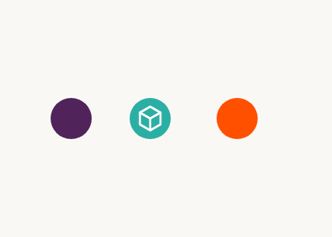 |
| `trayectoria(x0, y0, x1, y1, nodos, dash)` — curva ascendente con nodos y rótulos. | 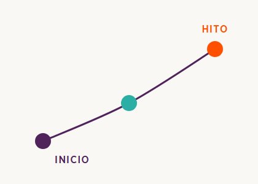 |
| `anillos(cx, cy, radios, colores, leyenda, centro_label)` — anillos concéntricos incompletos; cada capa suma una dimensión. | 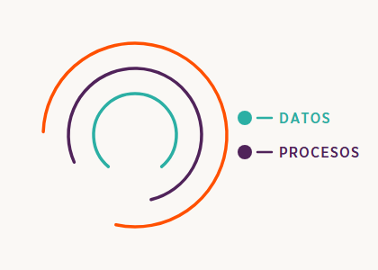 |
| `orbita(cx, cy, rx, ry, ...)` — elipse con nodo al centro y un nodo sobre la órbita. | 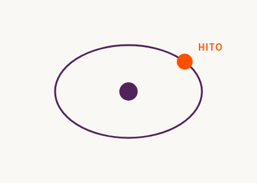 |
| `radial(cx, cy, r_core, r_spoke, n)` — núcleo con radios cortos terminados en nodos. | 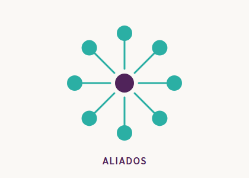 |
| `contenedor(x, y, w, h, color, label, mini)` — rectángulo de borde fino con un mini-gráfico adentro. | 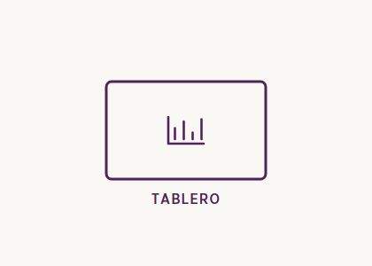 |
| `convergencia(x0, x_hub, y_hub, entradas, salida)` — varias líneas que confluyen en un nodo y salen como una sola. | 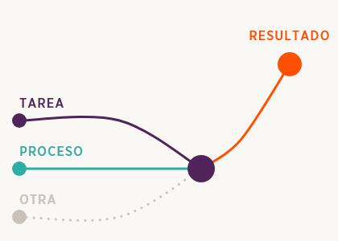 |
| `anillo_programa(cx, cy, r_ext, r_int)` — patrón canónico Negocio / Tecnología / Cultura alrededor del Programa de Transformación Digital. Obligatorio cuando el copy menciona esa integración. | 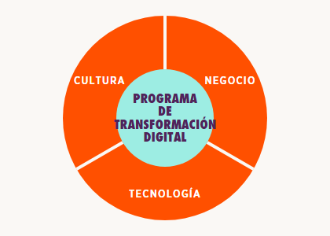 |
| `onda_inflexion(x0, x1, y_base, amp, label)` — sube, baja y vuelve a subir; círculo naranja en la inflexión. | 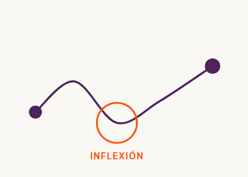 |
| `diana(cx, cy, radios, label)` — círculos concéntricos con un nodo naranja acercándose al centro. | 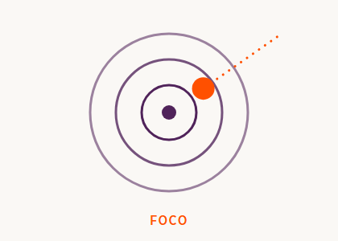 |
| `rotulo(x, y, txt, color, anchor, size)` — Gotham Narrow uppercase con tracking; `rotulo_multi` corta en varias líneas. | 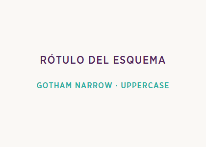 |
| `firma(x_der, y_centro)` — logo MOTION negro + separador vertical + descriptor en dos líneas. | 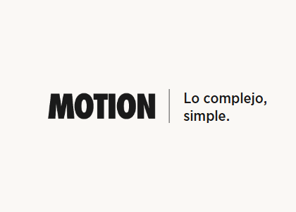 |
| `pager(n)` — círculo naranja con el número de placa en blanco. | 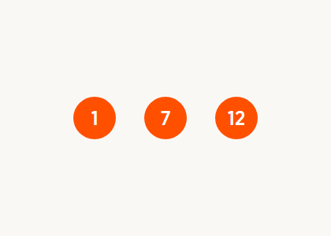 |
| `linea_base_punteada(x0, x1, y)` — onda punteada gris que da continuidad de serie. | 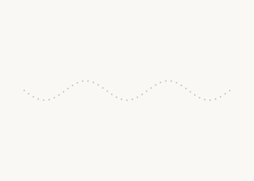 |

Auxiliares: `curva`, `arco`, `path`, `catmull`, `icono`, `texto`, `bloque`,
`wrap`, `text_width`, `rotulo_pos`, `documento`, `chars_usados`.

## Decisiones de implementación

- **Medición tipográfica exacta.** El corte de líneas y la ubicación de rótulos
  se calculan con las métricas reales de la OTF (fontTools) y el SVG se dibuja
  con `font-kerning: none`, así que lo medido en Python es exactamente lo que
  rasteriza Chromium.
- **Fuentes embebidas y subseteadas.** Cada SVG lleva solo los glifos que usa;
  pesa pocos KB extra y es autocontenido.
- **Sin solapamientos por construcción.** La zona visual arranca donde termina
  el texto; los rótulos de una curva ascendente se colocan siempre en el
  cuadrante abajo-derecha del nodo, que es el que queda libre.
- **Tamaño de rótulo.** El master describe rótulos de ~11px sobre una referencia
  de media resolución; sobre el canvas de 1080px equivalen a 20-22px, que es el
  valor usado. Bajar de ahí rompe la legibilidad móvil.
